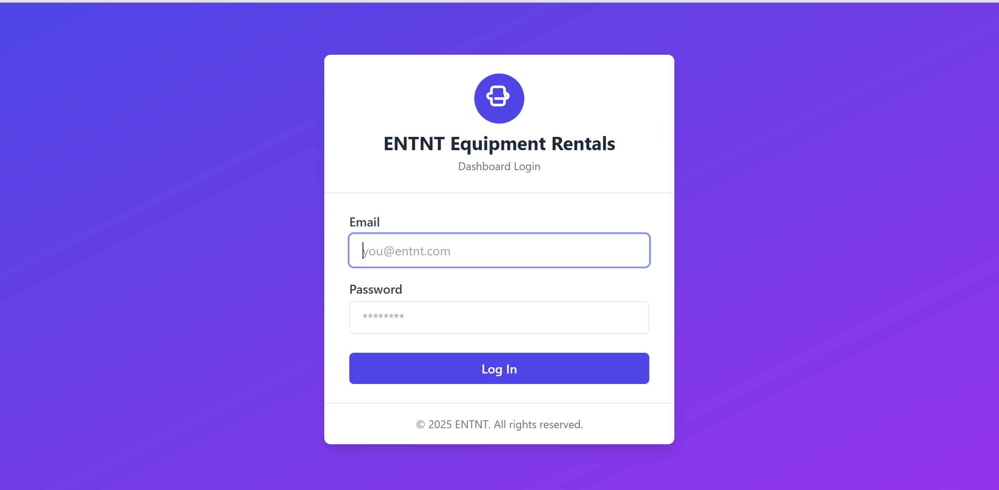
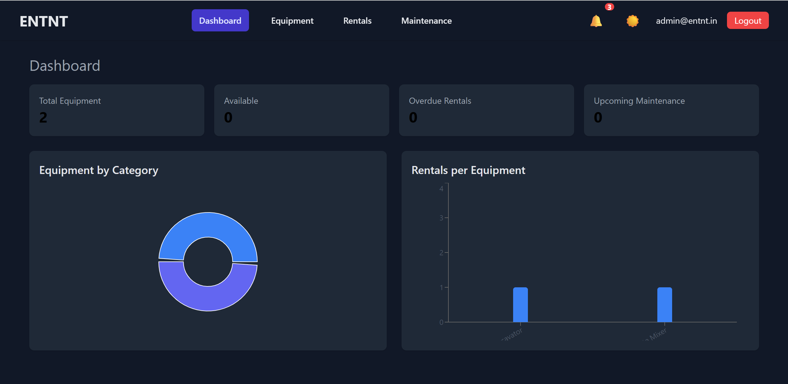

<!--
README.md for ENTNT Equipment Rental Management Dashboard
-->

<!-- Badges -->
[](https://reactjs.org/)
[](https://tailwindcss.com/)
[](https://vercel.com/)


# ENTNT Equipment Rental Management Dashboard

A **frontend-only** React application for managing equipment inventory, rental orders, and maintenance records at ENTNT.  
Features **role-based access** (Admin, Staff, Customer), **localStorage persistence**, **dark mode**, **responsive design**, and a **notifications center**.

---

## 📋 Table of Contents

- [✨ Features](#✨-features)  
- [🛠 Tech Stack](#🛠-tech-stack)  
- [📁 Project Structure](#📁-project-structure)  
- [🚀 Installation](#🚀-installation)  
- [👩‍💻 Usage](#👩‍💻-usage)  
- [🔐 Role-Based Access](#🔐-role-based-access)  
- [🌙 Dark Mode](#🌙-dark-mode)  
- [📦 Deployment](#📦-deployment)  
 

---

## ✨ Features

- **Authentication & Roles**  
  - Hard-coded users in localStorage:  
    - **Admin**: `admin@entnt.in` / `admin123`  
    - **Staff**: `staff@entnt.in` / `staff123`  
    - **Customer**: `customer@entnt.in` / `cust123`  
  - Login/logout with session persistence.  
  - Protected routes & UI elements based on `user.role`.  
  - Unauthorized redirects to `/unauthorized`.




- **Equipment Management**  
  - **List**, **Add**, **Edit**, **Delete** equipment (Admin only).  
  - **Edit**, **View**, **Add** (Staff).  
  - **Detail View** (Customer view-only).

- **Rental Orders**  
  - Create rentals (Staff/Admin can choose any customer; Customer can only rent themselves).  
  - Rental list filtered by role (Admin/Staff see all; Customer sees own).  
  - **Calendar View** (month/week/day) with React-Big-Calendar.  
  - Update status → **Reserved → Rented → Returned**.  
  - Automatically marks equipment status as “Rented” when a rental is created.

- **Maintenance Records**  
  - Add, view, delete maintenance (Admin/Staff).  
  - Dismissible notifications upon scheduling.

- **Dashboard**  
  - KPI cards: total equipment, available vs. rented, overdue rentals, upcoming maintenance.  
  - Charts via **Recharts** (pie chart: equipment by category; bar chart: rentals per equipment).

- **Notifications Center**  
  - Global notification context.  
  - Bell icon with badge in NavBar shows notification count.  
  - Dismissible list of notifications.

- **Rental Calendar**  
  - **React-Big-Calendar** integrated with date-fns.  
  - Month/Week/Day views. Prevents navigating before today or selecting past dates.  
  - Custom styling: light-blue highlight for today, weekend shading, blue event bars.

- **Responsive & Dark Mode**  
  - **Tailwind CSS** for utility-first styling.  
  - NavBar collapses into a hamburger menu on mobile.  
  - Dark mode toggle using **react-toggle-dark-mode**. Preference saved in `localStorage`.

---

## 🛠 Tech Stack

- **React 18** (functional components + hooks)  
- **React Router v6** (routing & protected routes)  
- **Context API** (Auth, Equipment, Rentals, Maintenance, Notifications, Theme)  
- **Tailwind CSS** (utility-first styling, dark mode)  
- **react-toggle-dark-mode** (DarkModeSwitch component)  
- **React-Big-Calendar** (rental calendar + agenda)  
- **Recharts** (dashboard charts)  
- **date-fns** (date utilities)  
- **uuid** (unique IDs)

---

## 📁 Project Structure

```
src/
│
├── components/
│   ├── Authentication/
│   │   └── LoginForm.jsx
│   ├── Dashboard/
│   │   ├── KPICards.jsx
│   │   └── Charts.jsx
│   ├── Equipment/
│   │   ├── EquipmentList.jsx
│   │   ├── EquipmentDetail.jsx
│   │   └── EquipmentForm.jsx
│   ├── Rentals/
│   │   ├── RentalList.jsx
│   │   ├── RentalForm.jsx
│   │   └── RentalCalendar.jsx
│   ├── Maintenance/
│   │   ├── MaintenanceList.jsx
│   │   └── MaintenanceForm.jsx
│   ├── Notifications/
│   │   └── NotificationCenter.jsx
│   └── Layout/
│       ├── NavBar.jsx
│       ├── Sidebar.jsx
│       └── Layout.jsx
│
├── contexts/
│   ├── AuthContext.jsx
│   ├── EquipmentContext.jsx
│   ├── RentalsContext.jsx
│   ├── MaintenanceContext.jsx
│   ├── NotificationsContext.jsx
│   └── ThemeContext.jsx
│
├── pages/
│   ├── LoginPage.jsx
│   ├── DashboardPage.jsx
│   ├── EquipmentPage.jsx
│   ├── EquipmentDetailPage.jsx
│   ├── RentalsPage.jsx
│   ├── MaintenancePage.jsx
│   └── UnauthorizedPage.jsx
│
├── utils/
│   ├── localStorageUtils.js
│   └── roleUtils.js
│
├── App.jsx
├── index.js
└── styles/
    └── main.css
```

- **`src/components/`**  
  UI components, organized by feature.  
- **`src/contexts/`**  
  React Contexts for global state management (e.g., Auth, Equipment, Rentals).  
- **`src/pages/`**  
  Top-level pages, each typically corresponding to a route (e.g., `/dashboard`, `/equipment`).  
- **`src/utils/`**  
  Utility functions (e.g., `roleUtils.js` to check roles, `localStorageUtils.js` for persistence).  
- **`App.jsx`**  
  Main application component; sets up routing and layouts.  
- **`index.js`**  
  Root file; renders `<App />` and provides `ThemeContext`.  
- **`styles/main.css`**  
  Tailwind CSS base file with imported directives.

---

## 🚀 Installation

1. **Clone the repository**  
   ```bash
   git clone https://github.com/codewithshivam01/ENTNT_DASHBOARD.git
   cd entnt-equipment-dashboard
   ```

2. **Install dependencies**  
   ```bash
   npm install
   ```

3. **Tailwind Setup**  
   - Tailwind and PostCSS are already configured (`tailwind.config.js` with `darkMode: 'class'`).  
   - `src/styles/main.css` includes the base `@tailwind` directives.

---

## 👩‍💻 Usage

1. **Start the development server**  
   ```bash
   npm run dev
   ```
   > By default, the app runs on [http://localhost:3000]().

2. **Log in**  
   - Navigate to `/login`.  
   - Use one of the hard-coded credentials:  
     - **Admin**: `admin@entnt.in` / `admin123`  
     - **Staff**: `staff@entnt.in` / `staff123`  
     - **Customer**: `customer@entnt.in` / `cust123`

3. **Dashboard**  
   - View KPI cards (e.g., total equipment, overdue rentals).  
   - Inspect charts powered by Recharts.

4. **Equipment**  
   - **Admin/Staff**: Add, edit, delete equipment via the Equipment page.  
   - **Customer**: View equipment list and details (read-only).

5. **Rentals**  
   - **Customers**: Create rentals for themselves; view status.  
   - **Staff/Admin**: Create rentals for any customer; update status.  
   - **Calendar View**: Click “Calendar” to switch to React-Big-Calendar view.

6. **Maintenance**  
   - **Admin/Staff**: Add/view/delete maintenance tasks.  
   - **Customer**: Cannot access maintenance pages.

7. **Notifications**  
   - New rental or maintenance actions trigger notifications.  
   - Click the bell icon in NavBar to view and dismiss notifications.

8. **Dark Mode**  
   - Click the moon/sun toggle in NavBar (from `react-toggle-dark-mode`).  
   - Preference is auto-saved to `localStorage`.

9. **Logout**  
   - Click “Logout” (desktop) or use the mobile menu to clear session and return to `/login`.

---

## 🔐 Role-Based Access

| **Role**  | **Permissions**                                                                                                                   |
|:---------:|:---------------------------------------------------------------------------------------------------------------------------------|
| **Admin** | - Dashboard (all data)<br>- Equipment: Add / Edit / Delete / View<br>- Rentals: Create / Update Status / View All<br>- Maintenance: CRUD<br>- Notifications     |
| **Staff** | - Dashboard (all data)<br>- Equipment: Edit / View / Add (no delete unless promoted)<br>- Rentals: Create / Update Status / View All<br>- Maintenance: CRUD<br>- Notifications |
| **Customer** | - Dashboard (own rentals only)<br>- Equipment: View-only list & details<br>- Rentals: Create (self only) / View own rentals<br>- View rental calendar (own rentals)<br>- Notifications<br>- **Cannot** access Maintenance |

> Protected routes and UI checks are implemented in `ProtectedRoute.jsx` and `roleUtils.js`.  
> Any unauthorized attempts are redirected to `/unauthorized`.

---

## 🌙 Dark Mode

- **Tailwind CSS** is configured with `darkMode: 'class'` in `tailwind.config.js`.  
- `ThemeContext` (in `src/index.js`) toggles `class="dark"` on the `<html>` element.  
- NavBar includes a `<DarkModeSwitch />` (24px size) from **react-toggle-dark-mode**.  
- **Light Mode**: White/light backgrounds with dark text.  
- **Dark Mode**: Gray/indigo backgrounds with lighter text.  
- User preference is saved in `localStorage` under `theme` key.

---

## 📦 Deployment

1. **Build for production**  
   ```bash
   npm run build
   ```

2. **Deploy**  
   - Push the contents of the `build/` folder to your preferred static host (e.g., **Vercel**, Netlify, GitHub Pages).  
   - Example (Vercel CLI):  
     ```bash
     npm i -g vercel
     vercel
     ```

3. **Live Demo**  
   View the live site at:  
   > `https://entntequipmentrentalmanagementdashb.vercel.app/login`  

---


---

<p align="center">
  <br>
  &mdash; Built with ❤️ by the SHIVAM SINGH &mdash;
  <br><br>
</p>
